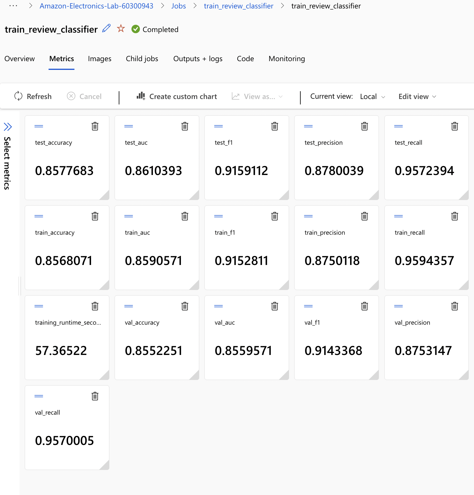
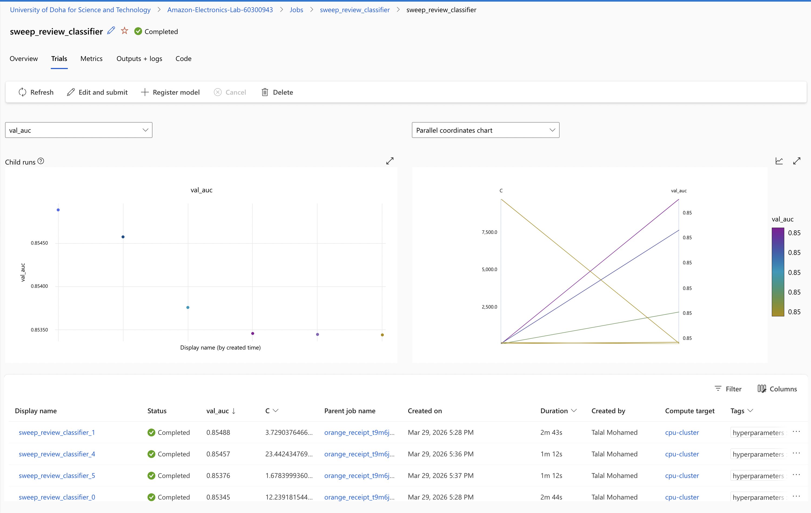
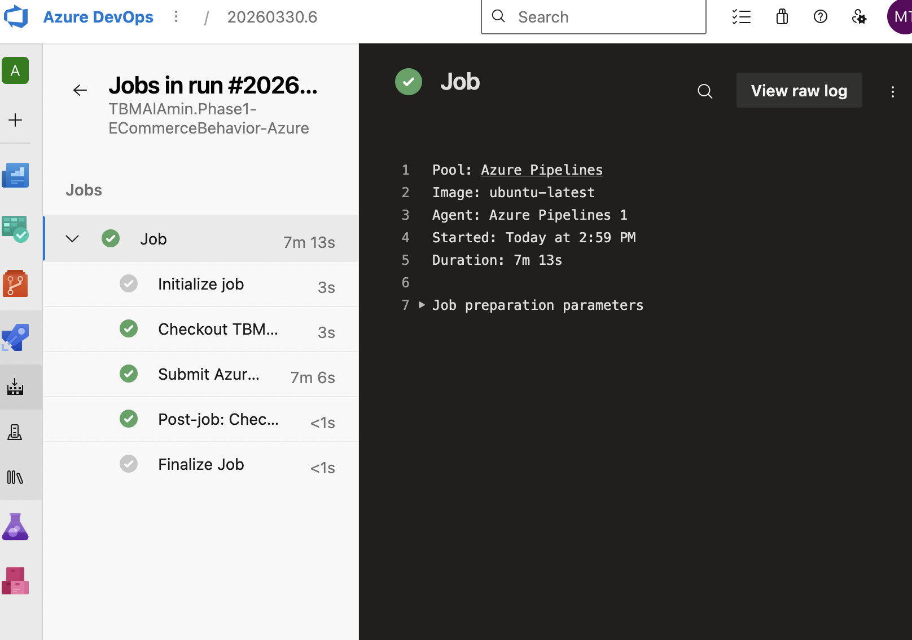
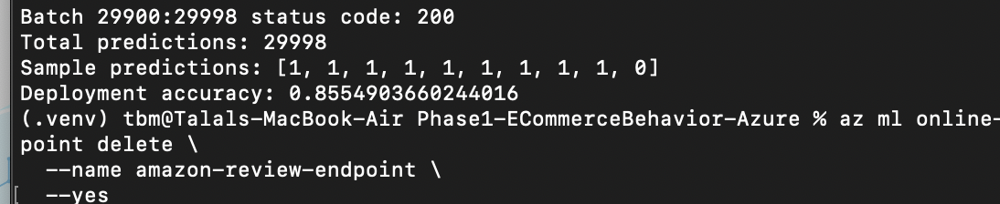

# Assignment 2 – Model Training, Deployment & Automation with Azure ML

## Overview

This project implements a complete end-to-end machine learning pipeline using Azure Machine Learning for sentiment classification on Amazon Electronics reviews.

The pipeline covers:
- Model training and evaluation
- Hyperparameter tuning
- Model registration
- Deployment to a managed online endpoint
- Endpoint invocation and evaluation
- CI/CD automation using Azure DevOps

**End-to-end workflow:**

code push → Azure DevOps pipeline → Azure ML training → MLflow tracking → model registration → deployment → inference

---

## Repository Structure
- src/
- env/
- jobs/
- screenshots/
### Key Components

#### src/
- `train.py` – model training, evaluation, MLflow logging, and model registration  
- `score.py` – inference logic used by the deployed endpoint  
- `invoke_endpoint.py` – sends requests to the endpoint and evaluates predictions  

#### env/
- `conda.yml` – environment for training  
- `inference_conda.yml` – environment for deployment  

#### jobs/
- `train_job.yml` – Azure ML training job  
- `sweep_job.yml` – hyperparameter tuning configuration  
- `deployment.yml` – endpoint deployment configuration  

---

## Workflow Implementation

### 1. Model Training

A supervised classification model was trained using engineered features derived from the eCommerce behavior dataset.

A lightweight scikit-learn model was selected to:
- Ensure fast training and inference
- Maintain interpretability
- Provide a strong baseline for deployment scenarios

The following evaluation metrics were logged using MLflow:
- **Accuracy** – overall prediction correctness  
- **AUC** – ability to distinguish between classes  
- **Precision / Recall** – performance on positive predictions  
- **F1-score** – balance between precision and recall  

Using multiple metrics ensures a robust evaluation, especially for classification tasks where class imbalance may exist.

---

### 2. Hyperparameter Tuning

A hyperparameter sweep was conducted using Azure ML to optimize model performance.

Key aspects:
- Multiple configurations were explored automatically  
- Best model selected based on **validation AUC**  
- Child runs compared within Azure ML Studio  

This step is critical because:
- Default parameters are rarely optimal  
- Tuning improves generalization performance  
- It ensures the deployed model is not underfitted or overfitted  

---

### 3. Model Registration

The best-performing model from the sweep was registered in the Azure ML Model Registry.

This provides:
- Version control for models  
- Reproducibility  
- Traceability between training runs and deployed models  

The registered model is used directly during deployment.

---

### 4. Model Deployment

The model was deployed to an **Azure ML Managed Online Endpoint**.

Deployment characteristics:
- Real-time inference via REST API  
- Scalable infrastructure managed by Azure  
- Uses `score.py` for request handling  

The scoring script:
- Loads the trained model from the model directory  
- Processes incoming JSON requests  
- Returns predictions  

---

### 5. Endpoint Invocation

The deployed endpoint was tested using `invoke_endpoint.py`.

#### Key challenge encountered:
- Initial requests failed with **413 Request Entity Too Large**
- This occurs when payload size exceeds server limits

#### Solution:
- Implemented **batch processing**
- Sent data in smaller chunks instead of a single large request

#### Final results:
- Total predictions: **29,998**
- Deployment accuracy: **0.8555**

#### Interpretation:
- Deployment accuracy closely matches training performance  
- Indicates:
  - No data leakage  
  - Stable model generalization  
  - Correct deployment configuration  

---

### 6. CI/CD Automation (Azure DevOps)

An Azure DevOps pipeline was configured to automate training.

Pipeline steps:
- Authenticate with Azure using service principal  
- Submit training job using Azure CLI  
- Execute successfully on code push  

#### Importance:
- Ensures reproducibility  
- Enables automated retraining  
- Integrates ML workflows into DevOps practices  

---

## 📊 Key Results

| Metric | Value |
|------|------|
| Test Accuracy | 0.8577 |
| Test AUC | 0.8610 |
| Test F1 Score | 0.9159 |
| Deployment Accuracy | 0.8555 |

### Analysis

- The small gap between test and deployment accuracy confirms:
  - Model consistency across environments  
  - No training-serving skew  
- Strong F1-score indicates effective handling of class balance  

---

## 📸 Evidence Screenshots

### 1. Training Metrics

### 2. Hyperparameter Sweep

### 3. Registered Model

### 4. Azure DevOps Pipeline Success

### 5. Endpoint Invocation Results

---

## Key Learnings

- Hyperparameter tuning significantly improves model performance compared to default settings  
- Deployment introduces real-world constraints such as request size limits  
- Batch processing is essential for scalable inference  
- CI/CD pipelines are critical for production-grade ML systems  
- Consistency between offline and deployed performance is a key indicator of a reliable ML pipeline  

---

## Conclusion

This project demonstrates a complete production-ready machine learning lifecycle using Azure ML.

From training and tuning to deployment and automation, all stages were successfully implemented and validated.

The system achieves strong performance while maintaining scalability, reproducibility, and reliability—key requirements for real-world ML systems.
