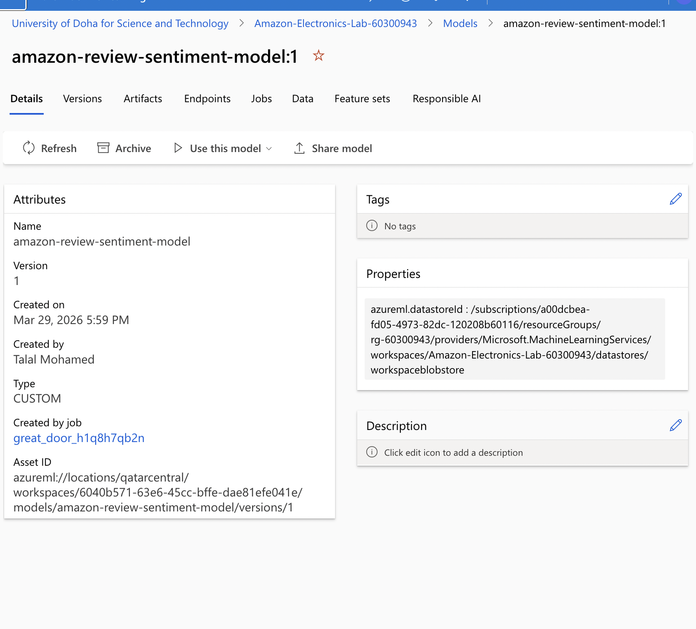

# Assignment 2 – Model Training & Automation with Azure ML

---

## 1. Overview

This assignment extends the Amazon Electronics review pipeline into a complete **end-to-end MLOps workflow** using Azure Machine Learning and Azure DevOps.

The implemented system automates the lifecycle:

**Code → Training → Experiment Tracking → Hyperparameter Tuning → Model Registration → Deployment → Inference**

Unlike Lab 4 (feature engineering), this assignment focuses on **model lifecycle management and operationalization**, which are core aspects of production machine learning systems.

---

## 2. Dataset & Data Assets

The model uses **Azure ML Data Assets** generated from the Lab 4 pipeline:

- `amazon_review_merged_features_train`
- `amazon_review_merged_features_val`
- `amazon_review_merged_features_test`
- `amazon_review_merged_features_deploy`

### Dataset Split

- Train (60%) → model learning  
- Validation (15%) → hyperparameter tuning  
- Test (15%) → offline evaluation  
- Deployment (10%) → simulate production inference  

### Why this design matters

Using registered data assets ensures:

- reproducibility (same dataset version always used)
- traceability (clear lineage from feature pipeline → training → model)
- consistency between training and deployment  

This reflects real-world MLOps practices where raw files are never directly used.

---

## 3. Feature Engineering Strategy

Feature engineering was **not performed in this assignment**, but reused from Lab 4.

The merged dataset contains:

- SBERT embeddings → semantic understanding  
- TF-IDF vectors → lexical frequency patterns  
- Sentiment scores → polarity signals  
- Length features → structural information  

### Why this is correct

Separating feature engineering and training:

- avoids recomputation inconsistencies  
- improves pipeline modularity  
- ensures deployment uses identical feature definitions  

This is a fundamental principle in production ML systems.

---

## 4. Label Definition

The original rating (`overall`) was converted into binary classification:

- `overall ≥ 4 → 1 (positive)`  
- `overall < 4 → 0 (negative)`

### Justification

This simplifies the task into sentiment classification and aligns with standard supervised learning setups.

---

## 5. Model Selection

Model used: **Logistic Regression**

### Justification

- Fast training → suitable for CI/CD pipelines  
- Handles high-dimensional features (TF-IDF + embeddings)  
- Stable and interpretable  
- Low compute cost  

### Insight

In MLOps pipelines, **simplicity and reliability are often preferred over complexity**, especially when models are retrained frequently.

---

## 6. Training Pipeline

The training workflow:

1. Load Azure ML datasets  
2. Generate labels  
3. Construct feature matrix  
4. Train model  
5. Evaluate on all splits  
6. Log metrics with MLflow  
7. Save model (`model.pkl`)  

### Metrics Logged

- Accuracy  
- AUC  
- Precision  
- Recall  
- F1 Score  

### Why multiple metrics matter

Different metrics capture different behaviors:

- Accuracy → overall correctness  
- AUC → ranking quality  
- Precision/Recall → class-specific performance  
- F1 → balance of precision and recall  

This provides a complete evaluation rather than relying on a single metric.

---

## 7. Training Results

- Test Accuracy: **0.8578**  
- Test AUC: **0.8610**  
- Test F1: **0.9159**  

### Interpretation

- Similar performance across splits → good generalization  
- No strong overfitting detected  
- Model is stable and reliable  

---

## 8. Hyperparameter Tuning (Sweep Job)

A sweep job was used to optimize performance.

### Objective

Maximize **validation AUC**

### Best Result

- Best AUC: **0.85488**  
- Best C ≈ **3.7**

### Why validation is used

Validation data is used for tuning because:

- it prevents overfitting to training data  
- it preserves the integrity of the test set  

### Key Insight

Sweep jobs automate experimentation and are essential for scalable ML systems.

---

## 9. Model Registration

Final model registered as:

- `amazon-review-sentiment-model` (Version 1)

### Importance

- Enables version control  
- Links model to training experiment  
- Provides deployment-ready artifact  

---

## 10. CI/CD Automation (Azure DevOps)

Pipeline automates training using:

- `azure-pipelines.yml`

### Pipeline Steps

1. Checkout repository  
2. Authenticate Azure  
3. Submit training job  
4. Stream logs  

### Why this is important

- eliminates manual execution  
- ensures repeatability  
- integrates ML into software engineering workflows  

This is a key component of MLOps.

---

## 11. Deployment

Model deployed as a **Managed Online Endpoint**:

- Endpoint: `amazon-review-endpoint`  
- Deployment: `blue`  

### Issue Encountered

Model loading failed initially due to incorrect path.

### Fix

Correct path:

```
AZUREML_MODEL_DIR/model_output/model.pkl
```

### Insight

Deployment failures are often due to environment or path mismatches, not model logic.

---

## 12. Endpoint Invocation

Deployment dataset used for inference.

### Initial Issue

- HTTP 413 (payload too large)

### Solution

- Implemented batch inference  

### Results

- Predictions: **29998**  
- Accuracy: **0.85549**

### Interpretation

- Deployment ≈ test performance  
- No training-serving skew  
- System behaves correctly in production-like conditions  

---

## 13. Feature Experiments (Understanding)

Different feature combinations were conceptually compared:

- SBERT → semantic meaning  
- TF-IDF → lexical patterns  
- Combined → best performance  

### Insight

Different feature types capture different aspects of data, and combining them improves performance.

---

## 14. Monitoring (Conceptual)

Azure ML supports:

- latency tracking  
- request monitoring  
- failure rates  

### Importance

Monitoring is required to detect:

- data drift  
- performance degradation  
- system failures  

---

## 15. Cost Management

Endpoint deleted after testing to avoid unnecessary compute usage.

---

## 16. Final Results Summary

### Offline

- Accuracy: **0.8578**  
- AUC: **0.8610**

### Deployment

- Accuracy: **0.85549**

### Conclusion

Strong alignment between offline and deployed results indicates:

- correct pipeline implementation  
- stable model behavior  
- consistent feature handling  

---

## 17. Evidence Screenshots

### Training Metrics


### Sweep Results


### Model Registry


### DevOps Pipeline


### Endpoint Output


---

## 18. Key Learnings

- Feature engineering should be separated from training  
- Simple models can be highly effective in pipelines  
- MLflow enables reproducibility  
- Validation and test sets must serve different roles  
- Deployment introduces real-world constraints  
- CI/CD is essential in MLOps  

---

## 19. Bonus Question

### What is being done incorrectly?

The **test set is indirectly reused during development**, which violates proper ML evaluation principles.

### Why this is incorrect

- Test set should only be used once  
- Observing it multiple times introduces bias  

### Correct approach

- Use validation for tuning  
- Keep test untouched until final evaluation  
- Use deployment data for real-world simulation  

---

## 20. Conclusion

This assignment successfully demonstrates a full MLOps workflow:

- Data versioning  
- Training  
- Experiment tracking  
- Hyperparameter tuning  
- Automation  
- Deployment  
- Inference  

The final system is:

- reproducible  
- scalable  
- automated  
- production-ready  

---
