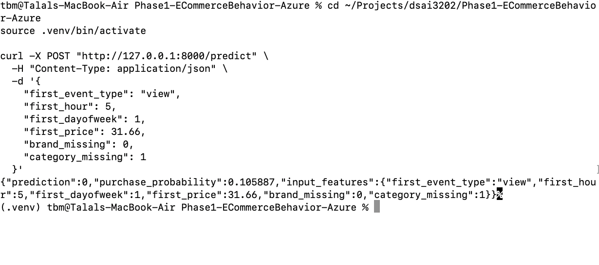
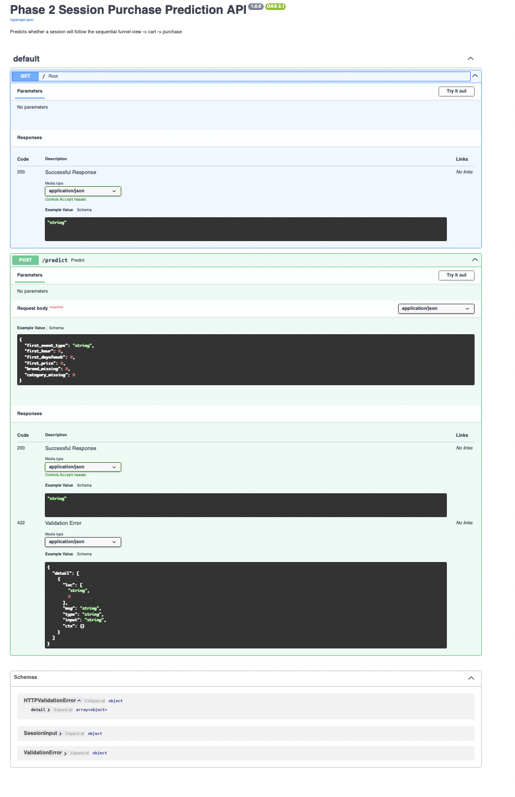
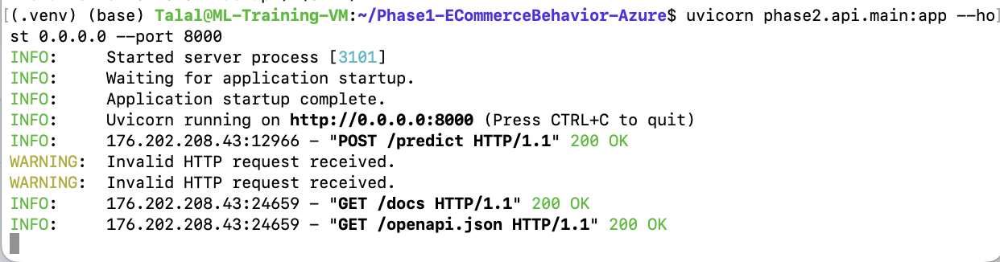
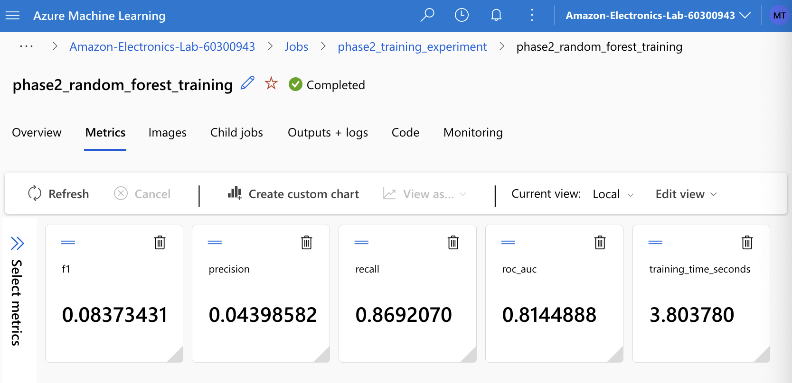
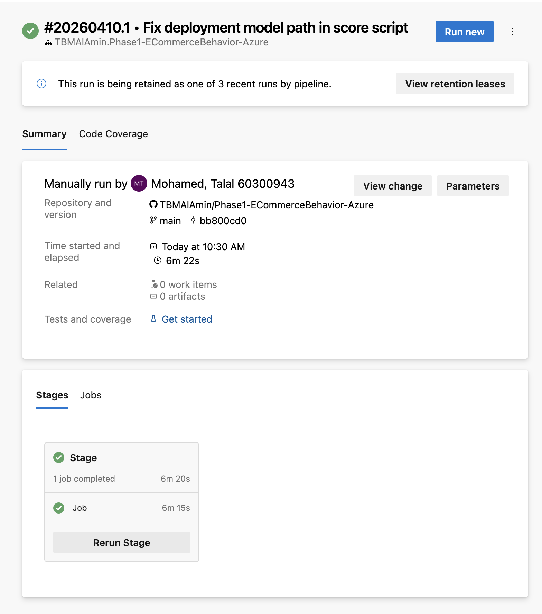

# Phase 2: Session Purchase Prediction – Modeling, Deployment & DevOps

## 1. Overview
This phase extends the analytics pipeline by building, deploying, and automating a machine learning model to predict whether a user session will result in a purchase.

The system follows a complete MLOps workflow:
Data → Feature Engineering → Model Training → Evaluation → Deployment → DevOps Automation

---

## 2. Objective
Predict session-level purchase probability using early session signals:
- first_event_type
- first_hour
- first_dayofweek
- first_price
- brand_missing
- category_missing

---

## 3. Dataset
Input dataset:
- phase2/data/session_dataset_safe.csv

---

## 4. Model Development
Model:
- Random Forest Classifier (scikit-learn)

Training script:
- src/train.py

Process:
- Load dataset
- Train model
- Evaluate performance
- Save model

---

## 5. Experiment Tracking (Azure ML)
Training executed using Azure Machine Learning.

Logged metrics:
- Precision
- Recall
- F1 Score
- ROC AUC
- Training Time

---

## 6. Model Registration
Model registered in Azure ML:
- Name: phase2-rf-model
- Version: 1

---

## 7. API Deployment
FastAPI endpoint:

http://<VM_PUBLIC_IP>:8000/predict

Example request:
curl -X POST "http://<VM_PUBLIC_IP>:8000/predict" \
-H "Content-Type: application/json" \
-d '{
  "first_event_type": "view",
  "first_hour": 5,
  "first_dayofweek": 1,
  "first_price": 31.66,
  "brand_missing": 0,
  "category_missing": 1
}'

---

## 8. DevOps Automation
Azure DevOps pipeline:
- Submits Azure ML training job
- Runs via YAML configuration
- Uses Azure CLI
- Executes on Azure Pipelines agent

---

## 9. Validation
System validated through:
- Successful API responses
- Azure ML training job completion
- DevOps pipeline execution

---

## 10. Screenshots

### API Request (curl)

### API Documentation (Swagger)

### API Server Logs

### Azure ML Training Job

### DevOps Pipeline

---

## 11. Repository Structure
phase2/
├── api/
├── data/
├── models/
├── src/

env/
jobs/
azure-pipelines.yml
README.md

---

## 12. Conclusion
This phase demonstrates a complete end-to-end MLOps pipeline including:
- Model training in Azure ML
- Deployment via FastAPI
- Automation using Azure DevOps

The system is reproducible, scalable, and aligned with industry MLOps practices.
