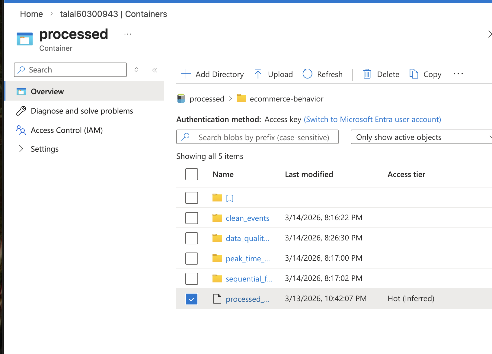
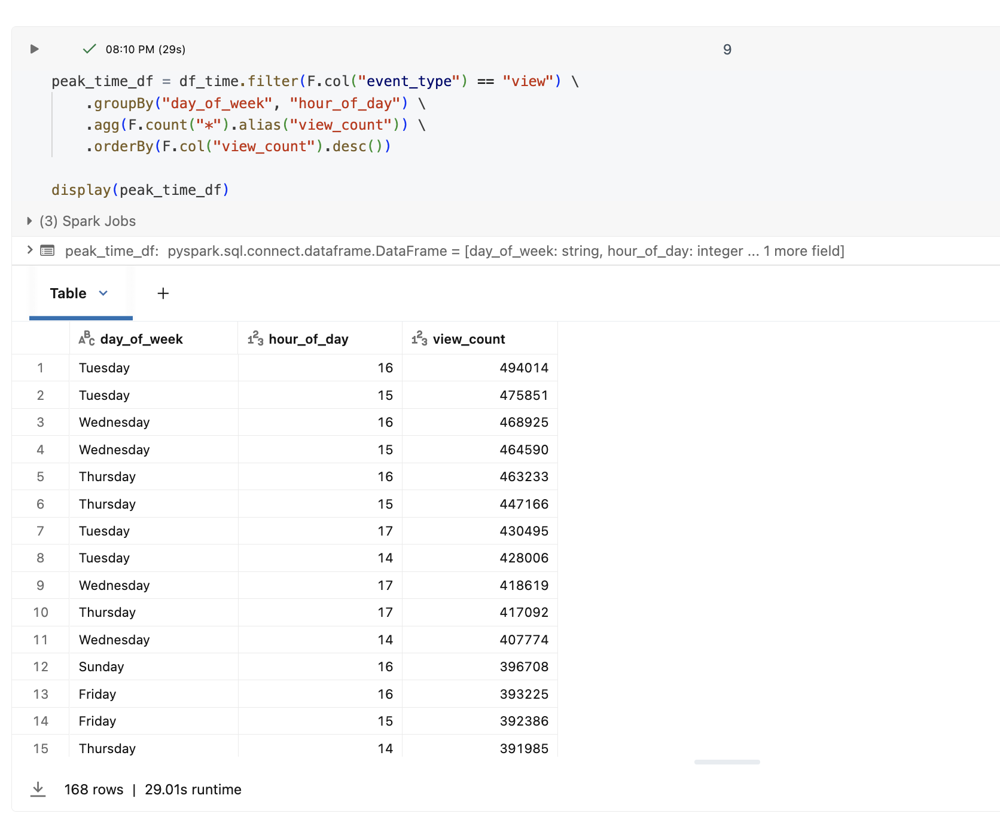
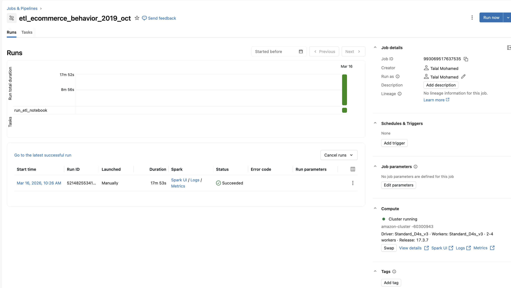

# E-Commerce Customer Behavior Analytics Pipeline (Azure)

## Project Overview
This project implements an **end-to-end data engineering pipeline on Microsoft Azure** to analyze how users interact with an e-commerce platform. The objective is to ingest raw behavioral logs, process them using distributed data processing, and generate insights about customer activity patterns.

The pipeline integrates **Azure Data Lake Storage Gen2, Azure Data Factory, and Azure Databricks (Apache Spark)** to transform raw event data into structured analytical outputs. The workflow demonstrates how modern cloud tools can be used to build scalable behavioral analytics pipelines.

Key analytical goals of the project include:

- Identifying **peak user activity times**
- Analyzing **customer interaction sequences**
- Performing **basic data quality validation**
- Exploring relationships between **product price and user activity timing**

The outputs of this pipeline could later support **recommendation systems, demand forecasting, or customer behavior modeling**.

---

## Dataset

**Source:** Kaggle – E-Commerce Behavior Dataset  
**File Used:** `2019-Oct.csv`

The dataset contains logs of customer activity on an online store. Each row represents a user interaction event such as viewing a product, adding it to a cart, or purchasing it.

### Key Attributes

| Column | Description |
|------|------|
| event_time | Timestamp of the event |
| event_type | Interaction type (view, cart, purchase) |
| product_id | Product identifier |
| category_id | Category identifier |
| category_code | Product category name |
| brand | Product brand |
| price | Product price |
| user_id | Unique user identifier |
| user_session | Session identifier |

The dataset is treated as a **monthly snapshot of user activity**, which simplifies the pipeline while still allowing meaningful behavioral analysis.

---

## System Architecture

The pipeline follows a **lakehouse-style architecture**, separating raw data ingestion from processed analytical outputs.

```
Kaggle Dataset
      │
      ▼
Azure Data Lake Storage (RAW zone)
      │
      ▼
Azure Data Factory Pipeline
      │
      ▼
Azure Databricks ETL Notebook (Apache Spark)
      │
      ▼
Azure Data Lake Storage (PROCESSED zone)
      │
      ▼
Analytical Outputs
```

### Technologies Used

| Component | Purpose |
|------|------|
| Azure Data Lake Storage Gen2 | Data storage |
| Azure Data Factory | Pipeline orchestration |
| Azure Databricks | Distributed data processing |
| Apache Spark | Data transformation and analytics |
| GitHub | Version control and documentation |

Using this architecture allows the system to scale to much larger behavioral datasets while keeping the pipeline modular and reproducible.

---

## Data Lake Structure

Two storage zones were implemented to separate raw and processed data.

### Raw Zone
The raw zone stores the dataset exactly as received from the source.

```
raw/
└── ecommerce-behavior/
    └── 2019-Oct.csv
```

This design ensures the original dataset remains **unchanged and reproducible**, which is important for auditing and reprocessing the pipeline if needed.

### Processed Zone
The processed zone stores cleaned datasets and analytical outputs generated by the pipeline.

```
processed/
└── ecommerce-behavior/
    ├── clean_events/
    ├── data_quality_summary/
    ├── peak_time_metrics/
    ├── sequential_funnel_metrics/
    └── processed_2019_oct.csv
```

Separating raw and processed data is a common data engineering practice that improves **pipeline reliability and data governance**.

### Processed Storage Evidence


---

## Data Processing Pipeline

All transformations were implemented using **PySpark in Azure Databricks**.

Apache Spark was selected because the dataset contains **millions of interaction records**, making distributed computation more efficient than single-machine processing.

### Pipeline Steps

1. **Data Ingestion**

The CSV dataset is loaded from the raw storage zone into a Spark DataFrame.

2. **Schema Inference**

Spark automatically determines column data types, allowing structured transformations to be applied.

3. **Feature Engineering**

Two time-based features were derived from the event timestamp:

| Feature | Description |
|------|------|
| day_of_week | Extracted weekday from event_time |
| hour_of_day | Extracted hour from event_time |

These features allow the system to analyze **temporal patterns in user activity**.

---

## Behavioral Analytics

### Peak Activity Analysis

User activity was aggregated by **day of week and hour of day** to identify the busiest periods on the platform.

This analysis counts the number of **view events** occurring during each time interval.

Understanding peak activity is valuable for e-commerce platforms because it helps optimize:

- server capacity
- marketing campaign timing
- product promotions

### Peak Time Analysis Result


The results show that user activity tends to peak during **afternoon hours (approximately 15-17)** across several weekdays.

---

### Sequential Funnel Metrics

Customer behavior was also analyzed using a **conversion funnel model**:

```
view → cart → purchase
```

This model represents the typical steps a user takes before completing a purchase.

By measuring transitions between these stages, the pipeline helps identify **where users drop off in the purchasing process**, which is important for improving conversion rates.

Results are stored in:

```
processed/ecommerce-behavior/sequential_funnel_metrics/
```

---

## Data Quality Validation

Before performing analytics, several basic quality checks were implemented to ensure the reliability of the dataset.

These checks include:

- null value inspection
- schema validation
- event consistency verification
- statistical summaries

The results are stored in:

```
processed/ecommerce-behavior/data_quality_summary/
```

Performing these checks ensures that downstream analytics are based on **consistent and trustworthy data**.

---

## Correlation Analysis

A statistical test was conducted to examine whether product price influences when users interact with products.

```
Correlation(hour_of_day, price) = 0.0158
```

The correlation value is extremely small, indicating **almost no relationship** between product price and the time of day when users view products.

This suggests that factors such as **user browsing habits or daily routines** likely play a larger role than price in determining when interactions occur.

---

## Automated Pipeline Execution

The ETL process is executed using a **Databricks Job**, which runs the Spark notebook automatically.

This allows the pipeline to be **reproducible and scalable**, since the same workflow can process future datasets without manual intervention.

### Successful Pipeline Execution


---

## Metadata & Data Governance

To improve transparency and reproducibility, a metadata document (`metadata_schema.md`) was created.

This file describes:

- dataset schema
- column definitions
- derived features
- data lineage
- analytical assumptions

Maintaining metadata helps ensure that the pipeline can be **understood and reused by other data engineers or analysts**.

---

## Version Control

All project artifacts are tracked in **GitHub**, including:

- Databricks ETL notebook
- metadata documentation
- project documentation

Version control ensures that the pipeline remains **reproducible, auditable, and collaborative**.

---

## Engineering Reflection

While implementing this pipeline, one key takeaway was the importance of separating **data storage, processing, and orchestration layers**. Using Azure Data Lake for storage, Databricks for computation, and Data Factory for orchestration created a modular architecture that is easy to extend or scale.

Even though the dataset used here represents only one month of activity, the same architecture could easily support **larger multi-month behavioral datasets or real-time streaming pipelines** in a production environment.

---

## Key Takeaways

This project demonstrates how cloud-native tools can be used to build a **scalable behavioral analytics pipeline**.

The system:

- ingests raw user interaction data
- processes it using distributed Spark computation
- extracts behavioral insights
- stores structured outputs in a data lake

Such pipelines form the foundation for **customer analytics, recommendation systems, and predictive modeling in modern e-commerce platforms**.
